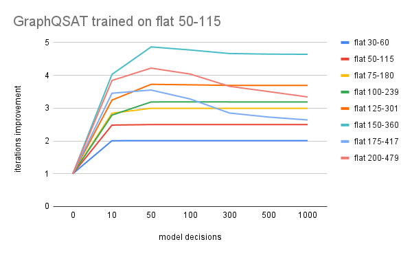
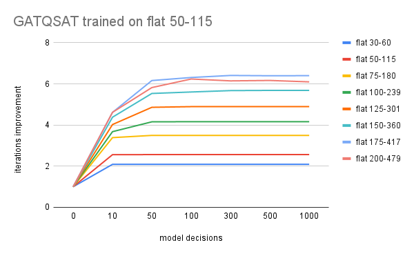

# NeuroSAT

[](https://colab.research.google.com/github/dmeoli/neuro-sat/blob/master/GraphQSAT.ipynb)
[](https://colab.research.google.com/github/dmeoli/neuro-sat/blob/master/GATQSAT.ipynb)

[](https://colab.research.google.com/github/dmeoli/neuro-sat/blob/master/AlphaZeroSAT.ipynb)

Neuro-symbolic approaches to the SAT problem.

This code has been developed in the context of Pattern Recognition and Reinforcement Learning courses @
[Department of Computer Science](https://www.di.unipi.it/en/)
@ [University of Pisa](https://www.unipi.it/index.php/english)
under the supervision of prof. [Davide Bacciu](http://pages.di.unipi.it/bacciu/).

## Contents

- **Reinforcement Learning** (*Alpha Zero (MCTS)*) approach described in [1].

- **Supervised Learning** (*[GNN](https://arxiv.org/abs/1806.01261)*) +
  **Reinforcement Learning** (*DQN*) approach described in [2].

    - [x] [*Graph Attention Networks (GATs)*](https://arxiv.org/abs/1710.10903)

  The experimental results of *GraphQSAT* and *GATQSAT* models can be
  viewed [here](https://docs.google.com/spreadsheets/d/1j0gQxsOPizNu8hm-nM1YY8bsdpbmWxYGVotj4h5d-wU).

  |  |
  |---------------------------------|
  |    |

The final presentation of the course project can be
found [here](https://docs.google.com/presentation/d/1rmFL_RhLS2fjGHb9SM14qdb7o3Oh0iOSlqirF0OQaX8).

## Split dataset

```bash train_val_test_split.sh {uniform-random-3-sat | graph-coloring}```

## License [](https://opensource.org/licenses/MIT)

This software is released under the MIT License. See the [LICENSE](LICENSE) file for details.

## References

[1] Wang, Fei, and Tiark Rompf, [*From Gameplay to Symbolic Reasoning: Learning SAT Solver Heuristics in the Style of
Alpha(Go) Zero*](https://arxiv.org/abs/1802.05340).

[2] Kurin, Vitaly, et al., [*Can Q-Learning with Graph Networks Learn a Generalizable Branching Heuristic for a SAT
Solver?*](https://arxiv.org/abs/1909.11830).
