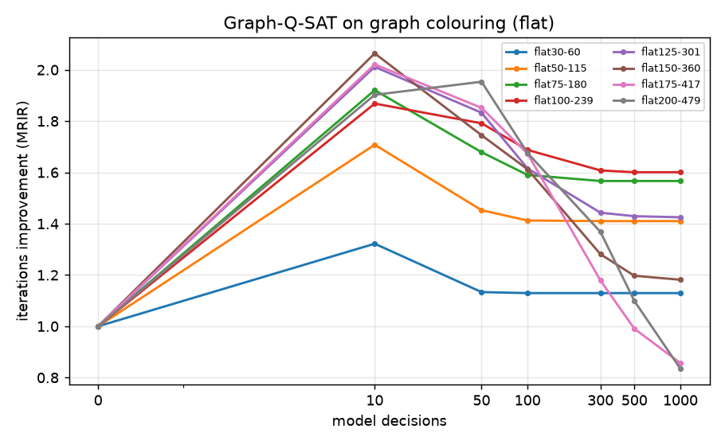
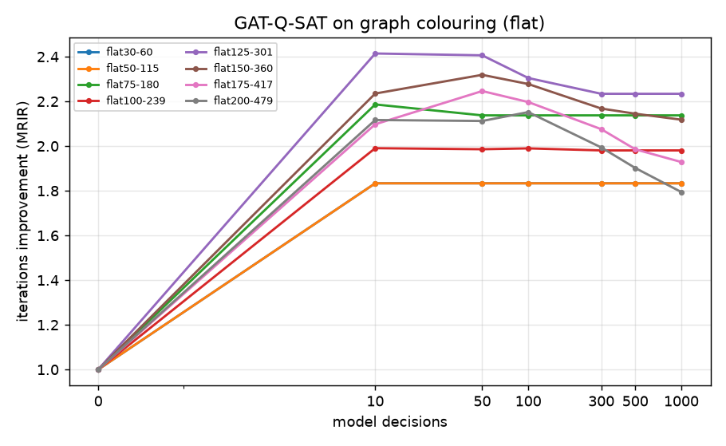

# NeuroSAT

[](https://colab.research.google.com/github/dmeoli/NeuroSAT/blob/master/notebooks/graph_q_sat.ipynb)
[](https://colab.research.google.com/github/dmeoli/NeuroSAT/blob/master/notebooks/alphazero_sat.ipynb)
[](https://opensource.org/licenses/MIT)

**Neuro-symbolic approaches to the SAT problem** — learning branching heuristics
for a Boolean SAT solver with reinforcement learning, CNNs and Graph Neural
Networks.

Developed for the Pattern Recognition and Reinforcement Learning courses @
[Department of Computer Science](https://www.di.unipi.it/en/),
[University of Pisa](https://www.unipi.it/index.php/english), under the
supervision of prof. [Davide Bacciu](http://pages.di.unipi.it/bacciu/). The
original implementations (TensorFlow 1.x, GSL, pinned legacy libraries) have been
**ported to a single, self-contained, latest-version PyTorch stack** and the
published results are **reproduced exactly**.

## Approaches

| Model | Method | Framework | Where |
|-------|--------|-----------|-------|
| **AlphaZeroSAT** | Alpha(Go)Zero + MCTS over a CNN policy/value net [1] | PyTorch | [`AlphaZeroSAT/`](AlphaZeroSAT) |
| **Graph-Q-SAT** | DQN + Graph Neural Network ([GNN](https://arxiv.org/abs/1806.01261)) [2] | PyTorch + PyG | [`GQSAT/`](GQSAT) |
| **GAT-Q-SAT** | Graph-Q-SAT + [Graph Attention](https://arxiv.org/abs/1710.10903) (this project) | PyTorch + PyG | [`GQSAT/`](GQSAT) |
| **GTv2-Q-SAT** | GAT-Q-SAT + [GATv2](https://arxiv.org/abs/2105.14491) Transformer block, à la [NeuroBack](https://arxiv.org/abs/2110.14053) (this project) | PyTorch + PyG | [`GQSAT/`](GQSAT) |

**Key finding:** graph attention (GAT-Q-SAT, and its GATv2 successor GTv2-Q-SAT)
helps on *structured* problems (graph colouring), while plain Graph-Q-SAT is
stronger on uniform-random 3-SAT.

| Graph-Q-SAT | GAT-Q-SAT |
|:-:|:-:|
|  |  |

## Repository layout

```
neuroSAT/
├── AlphaZeroSAT/       # Alpha(Go)Zero + MCTS (PyTorch) — submodule (pure engine)
│   ├── models_torch.py        # CNN policy/value nets (Model1/2/3)
│   ├── alphazero_torch.py     # AZTrainer (AlphaZero loss + Adam)
│   ├── train_torch.py         # self-play + supervised training driver
│   ├── eval_torch.py          # branching-decisions evaluator (paper metric)
│   ├── mct.py, sl_buffer_d.py # MCTS glue + replay buffer
│   └── MCTSminisat/           # MCTS-aware MiniSat env (GSL-free, build_so.sh)
├── GQSAT/              # Graph-Q-SAT / GAT-Q-SAT / GTv2-Q-SAT (DQN + GNN) — submodule (pure engine)
│   ├── gqsat/                 # models, learners, agents, buffer, utils
│   ├── minisat/               # patched MiniSat + gym env (submodule)
│   ├── dqn.py, evaluate.py    # training / evaluation
│   ├── aggregate_results.py   # runs/*.tsv -> results/*.md + summary.csv
│   ├── make_plots.py          # runs/*.tsv -> img/*.png
│   └── runs/                  # trained checkpoints + evaluation logs (.tsv)
├── notebooks/          # graph_q_sat.ipynb, alphazero_sat.ipynb (end-to-end Colab pipelines)
├── data/               # shared SAT datasets, DIMACS .cnf (outside both submodules)
│   ├── uniform-random-3-sat/  # uf/uuf 50..250
│   ├── graph-coloring/        # flat30-60 .. flat200-479 (structured)
│   └── uf20-91/               # AlphaZeroSAT train/test splits
├── img/                # result plots (regenerated by make_plots.py)
├── papers/             # reference PDFs (see papers/README.md)
├── report/             # LaTeX written report  (pdflatex report/neurosat.tex)
├── slides/             # LaTeX Beamer slides   (pdflatex slides/neurosat-slides.tex)
└── requirements.txt
```

## Getting the code

```sh
git clone --recurse-submodules https://github.com/dmeoli/NeuroSAT.git
```

## Environment

The PyTorch models run on a current stack — latest `torch`, `torch-geometric`
(no `torch-scatter`/`torch-sparse`), `numpy>=2`, `gymnasium`.

```sh
python3 -m venv .venv            # or: pip install virtualenv && python3 -m virtualenv .venv
source .venv/bin/activate
pip install -r requirements.txt
```

Both projects use a native MiniSat gym extension built with `g++`/`zlib`
(no GSL); build it for your Python + NumPy:

```sh
# Graph-Q-SAT
cd GQSAT/minisat && make python-wrap \
    PYTHON=python$(python -c 'import sys;print(f"{sys.version_info.major}.{sys.version_info.minor}")') \
    NUMPY_INC="$(python -c 'import numpy; print(numpy.get_include())')" && cd ../..

# AlphaZeroSAT
cd AlphaZeroSAT && PYTHON=python3 bash MCTSminisat/build_so.sh && cd ..
```

## Usage

```sh
# split a dataset into train/val/test
bash train_val_test_split.sh {uniform-random-3-sat | graph-coloring}

# reproduce a Graph-Q-SAT / GAT-Q-SAT evaluation (add --no-cuda on CPU)
cd GQSAT && python evaluate.py --env-name sat-v0 --core-steps -1 --eps-final 0.0 \
    --no_restarts --no-cuda --test_time_max_decisions_allowed 500 \
    --eval-problems-paths ../data/graph-coloring/flat30-60 \
    --model-dir runs/Dec08_08-39-57_e63e47f25457 --model-checkpoint model_50000.chkp

# regenerate result tables + plots from the logs
cd GQSAT && python aggregate_results.py && python make_plots.py

# train AlphaZeroSAT (GPU auto-detected; data from the shared ../data hub) + per-cycle eval
cd AlphaZeroSAT && python train_torch.py --train_path ../data/uf20-91/train_v0 \
    --eval_path ../data/uf20-91/test_v0 --device auto
```

Each model has a self-contained, end-to-end Colab pipeline (setup → data →
training → evaluation → results):
[`notebooks/graph_q_sat.ipynb`](notebooks/graph_q_sat.ipynb) for the graph models
and [`notebooks/alphazero_sat.ipynb`](notebooks/alphazero_sat.ipynb) for
AlphaZeroSAT. The evaluation tables live in [`GQSAT/results/`](GQSAT/results).

## License

Released under the MIT License — see [LICENSE](LICENSE).

## References

[1] Wang, Fei, and Tiark Rompf, [*From Gameplay to Symbolic Reasoning: Learning SAT
Solver Heuristics in the Style of Alpha(Go) Zero*](https://arxiv.org/abs/1802.05340).

[2] Kurin, Vitaly, et al., [*Can Q-Learning with Graph Networks Learn a Generalizable
Branching Heuristic for a SAT Solver?*](https://arxiv.org/abs/1909.11830).

See [`papers/`](papers) for the full reference list (NeuroSAT, NeuroCore,
NeuroBack, …) and the written [report](report/neurosat.tex) for a discussion of
how this work relates to the subsequent literature.
